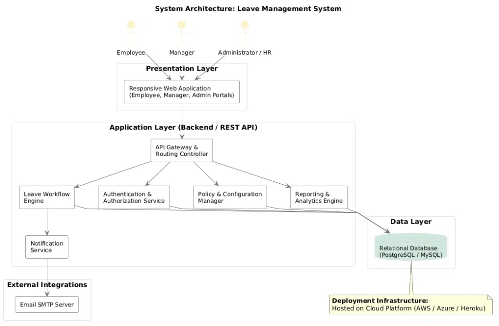
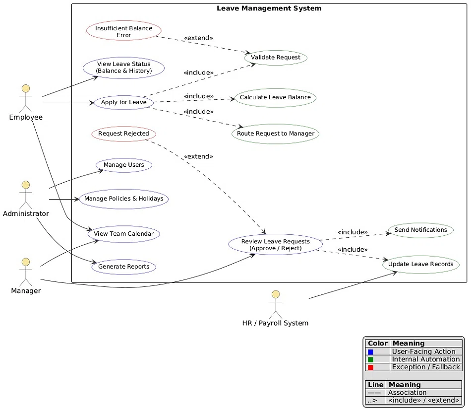
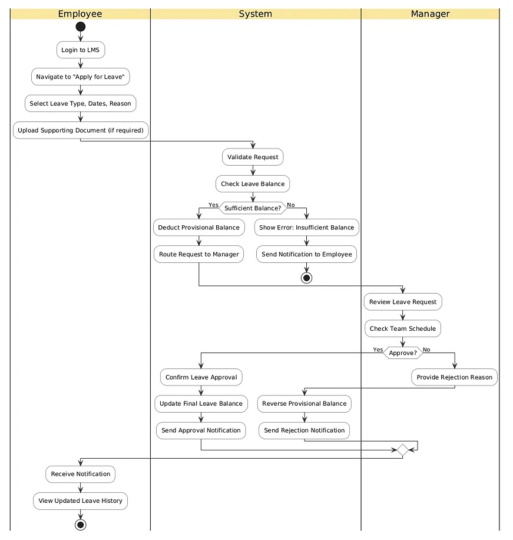
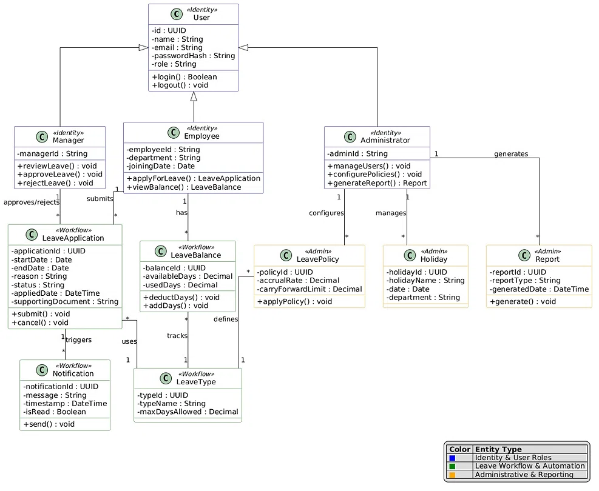

# Leave Management System (LMS)
### *An Automated Web-Based Solution for Employee Leave Management*


---

## 📌 Table of Contents
- [Project Overview](#-project-overview)
- [Project Team Members](#-project-team-members)
- [Problem Background & Statement](#-problem-background--statement)
- [Key Impacts & Benefits](#-key-impacts--benefits)
- [Core Features](#-core-features)
- [System Architecture & Design Diagrams](#-system-architecture--design-diagrams)
  - [1. System Architecture](#1-system-architecture-diagram)
  - [2. Use Case Model](#2-use-case-diagram)
  - [3. Workflow & Activity Diagram](#3-activity--workflow-diagram)
  - [4. Domain Class Diagram](#4-class-diagram--data-model)
- [System Requirements Specification](#-system-requirements-specification)
  - [Functional Requirements](#functional-requirements)
  - [Non-Functional Requirements](#non-functional-requirements)
- [Project Scope](#-project-scope)
- [Technology Feasibility & Stack](#-technology-feasibility--stack)
- [Expected Outcomes](#-expected-outcomes)
- [Repository Directory Structure](#-repository-directory-structure)

---

## 👥 Project Team Members

This project is conceived, designed, developed, and documented as part of the **B.Tech Major Project** in **Computer Science Engineering** by:

| S. No. | Name | Roll Number | Project Role | Primary Responsibilities |
| :---: | :--- | :---: | :--- | :--- |
| **1** | **Varun Kushwah** | `2400290120275` | **Team Lead / Backend Development** | Architecture design, REST API development, business logic, workflow engine, and system integration |
| **2** | **Vaibhav Gupta** | `2400290120270` | **Frontend Development** | Responsive UI/UX implementation, client-side routing, employee/manager dashboards, calendar integration |
| **3** | **Tanya Bhadana** | `2400290120251` | **Database Design & Testing** | Relational schema design, normalization, data integrity, test suite design, and QA verification |
| **4** | **Sudiksha Chauhan** | `2400290120260` | **Documentation & UI/UX Design** | SRS/IEEE documentation, elicitation, wireframes, user journeys, and technical writing |

---

## 📖 Project Overview

Leave management is a fundamental administrative process within organizations, academic institutions, and corporate enterprises. The **Leave Management System (LMS)** is a modern, web-based platform engineered to eliminate paper-bound bureaucracy by digitizing and automating the complete employee leave application, approval, and record-keeping lifecycle.

By replacing disparate spreadsheets, physical forms, and manual approvals with a single, role-based, real-time portal, the system ensures data accuracy, accelerates request processing, provides transparent leave balances, and facilitates informed workforce planning.

---

## ❗ Problem Background & Statement

### Background
In traditional workplace settings, leave applications are submitted through handwritten paper forms or emailed ad-hoc spreadsheets. Supervisors must physically sign or manually approve requests, after which human resources (HR) staff manually reconcile and deduct days in separate logs.

### The Inefficiencies
- **Administrative Friction:** HR departments spend excessive time manually tallying days, accruals, and carry-forwards.
- **Lost & Misplaced Records:** Paper slips and email threads get misplaced, leading to auditing gaps.
- **Approval Bottlenecks:** Requests remain stalled when managers or approvers are travelling or out of office.
- **Absence of Visibility:** Employees have no real-time insight into available leave balances or processing status.
- **Resource Conflicts:** Lack of a unified team calendar causes multiple key personnel to take leave simultaneously without prior scheduling coordination.

### Problem Statement
> *"There is a critical need for a centralized, digital Leave Management System that allows employees to apply for leave online, enables managers or administrators to review and approve/reject requests efficiently, and automatically maintains accurate, real-time records of leave balances and leave history — thereby eliminating delays, human error, and lack of transparency associated with manual processing."*

---

## 🌟 Key Impacts & Benefits

```
   Manual Friction                Automated Digital LMS
┌──────────────────────┐         ┌─────────────────────────┐
│ Paper-based forms    │  ───►   │ 1-Click Online Request  │
│ Delayed sign-offs    │  ───►   │ Instant Notifications   │
│ Balance disputes     │  ───►   │ Automated Calculations  │
│ Misplaced records    │  ───►   │ Centralized SQL Database│
│ Scheduling blindness │  ───►   │ Unified Team Calendar   │
└──────────────────────┘         └─────────────────────────┘
```

- **Accelerated Turnaround:** Approval turnaround times decrease from days to minutes via automated routing.
- **100% Record Accuracy:** Direct database calculations prevent miscalculations and disputes.
- **Employee Self-Service:** Immediate self-check of remaining leave balances, accruals, and historical applications.
- **Managerial Decision Support:** Real-time visibility into team members' planned leaves prevents project delays.
- **Auditable & Compliant:** Centralized records facilitate compliance checks and HR management reports.

---

## ⚙️ Core Features

- **Role-Based Access Control (RBAC):** Tailored permissions and user interfaces for **Employees**, **Managers / Approvers**, and **Administrators / HR**.
- **Leave Application Engine:** Multi-category leave requests (Casual, Sick, Earned/Privilege, Maternity/Paternity) with date picking and mandatory supporting document attachments (e.g., medical certificates).
- **Automated Workflow & Routing:** Real-time routing of leave requests directly to the designated department manager.
- **Provisional Balance Reservation:** Temporary balance holding during pending states to prevent double-booking or overdrawing.
- **Interactive Team Calendar:** Visual representation of approved leaves to prevent department under-staffing.
- **Email & In-App Notifications:** Real-time dispatch of alerts for submission, manager review, approval, and rejection.
- **HR Administration Suite:** Management of annual holiday calendars, leave policy parameters (accrual rates, carry-forward limits), and analytical report exports.

---

## 📐 System Architecture & Design Diagrams

The design and engineering of the system are governed by standard software engineering models, illustrated in the architectural diagrams below:

---

### 1. System Architecture Diagram
The application follows a **3-Tier Layered Architecture** ensuring modularity, scalability, and security between the presentation, business logic, and persistence tiers.



#### Architectural Layers:
1. **Presentation Layer:**
   - Responsive web portals customized for Employees, Managers, and HR/Administrators accessible via desktop and mobile browsers.
2. **Application Layer (Backend / REST API):**
   - **API Gateway & Routing Controller:** Entry point validating routes, CORS, and request forwarding.
   - **Authentication & Authorization Service:** Manages user sessions, password hashing, and role verification (RBAC).
   - **Leave Workflow Engine:** Core orchestrator processing status transitions, approvals, and balance adjustments.
   - **Policy & Configuration Manager:** Enforces department rules, accrual rates, and annual limits.
   - **Reporting & Analytics Engine:** Generates department summaries and organizational leave analytics.
   - **Notification Service:** Communicates asynchronously with external SMTP servers.
3. **External Integrations:**
   - **Email SMTP Server:** Dispatches instant transactional email updates to employees and approvers.
4. **Data Layer:**
   - **Relational Database (PostgreSQL / MySQL):** Maintains referential integrity for identity, application logs, policies, balances, and audit trails.
5. **Deployment Infrastructure:**
   - Cloud-native deployment model suitable for hosting on platforms such as AWS, Microsoft Azure, or Heroku.

---

### 2. Use Case Diagram
The Use Case diagram specifies the interactions between external actors and system boundaries, differentiating user-facing actions, automated background services, and exception branches.



#### Actors & Functional Allocations:
- **Employee:**
  - *Apply for Leave:* Includes automated validations (`Validate Request`), live balance calculation (`Calculate Leave Balance`), and dispatch (`Route Request to Manager`).
  - *Exception Handling:* Extends `Insufficient Balance Error` if requested days exceed entitlement.
  - *View Leave Status:* Checks remaining balance by type and past historical submissions.
- **Manager / Approver:**
  - *Review Leave Requests (Approve / Reject):* Includes automatic triggers to `Send Notifications` and `Update Leave Records`.
  - *Exception Handling:* Extends `Request Rejected` with compulsory feedback/remarks.
  - *View Team Calendar:* Assesses workforce density before approving or rejecting.
- **Administrator / HR:**
  - *Manage Users:* Provisions accounts, assigns roles, and updates employee departments.
  - *Manage Policies & Holidays:* Defines leave types, accrual caps, carry-over rules, and official holidays.
  - *Generate Reports:* Extracts organizational and department-level leave trend analytics.
- **HR / Payroll System:**
  - Downstream integration actor reflecting finalized leave deductions for records and payroll compliance.

---

### 3. Activity & Workflow Diagram
The Activity Swimlane diagram delineates the end-to-end execution flow between the **Employee**, the **System Core**, and the **Manager**.



#### Step-by-Step Lifecycle:
1. **Initiation (Employee):** Employee logs in, navigates to "Apply for Leave", selects leave type, date range, specifies reason, and uploads supporting documents (if required).
2. **Validation & Balance Check (System):** System validates the date validity and inspects the employee's available balance:
   - *If Balance Insufficient:* Displays error prompt, terminates request, and dispatches notification.
   - *If Balance Sufficient:* Deducts provisional balance and forwards request to the manager's pending queue.
3. **Managerial Evaluation (Manager):** Manager reviews details and verifies the team work calendar:
   - *Case Rejection:* Manager enters reason for denial $\rightarrow$ System rolls back and reverses the provisional balance $\rightarrow$ Sends rejection notification.
   - *Case Approval:* Manager confirms approval $\rightarrow$ System commits the deduction to the final balance $\rightarrow$ Updates leave records $\rightarrow$ Sends approval notification.
4. **Completion (Employee):** Employee receives the notification and views their refreshed leave history and balance ledger.

---

### 4. Class Diagram & Data Model
The Class Diagram outlines the Object-Oriented design and data schema, highlighting identity boundaries, workflow state machines, and administrative entities.



#### Entity Class Breakdown:
- **Identity & User Roles (`«Identity»`):**
  - `User`: Base abstraction encapsulating `id`, `name`, `email`, `passwordHash`, `role`, `login()`, and `logout()`.
  - `Employee`: Inherits `User`. Adds `employeeId`, `department`, `joiningDate`, `applyForLeave()`, and `viewBalance()`.
  - `Manager`: Inherits `User`. Adds `managerId`, `reviewLeave()`, `approveLeave()`, and `rejectLeave()`.
  - `Administrator`: Inherits `User`. Adds `adminId`, `manageUsers()`, `configurePolicies()`, and `generateReport()`.
- **Workflow & Automation (`«Workflow»`):**
  - `LeaveApplication`: Contains `applicationId`, `startDate`, `endDate`, `reason`, `status`, `appliedDate`, `supportingDocument`, and methods `submit()` / `cancel()`.
  - `LeaveBalance`: Tracks `balanceId`, `availableDays`, and `usedDays`, with operations `deductDays()` and `addDays()`.
  - `LeaveType`: Defines category attributes (`typeId`, `typeName`, `maxDaysAllowed`).
  - `Notification`: Manages alerts (`notificationId`, `message`, `timestamp`, `isRead`, `send()`).
- **Administrative & Reporting (`«Admin»`):**
  - `LeavePolicy`: Governs `policyId`, `accrualRate`, and `carryForwardLimit`.
  - `Holiday`: Records `holidayId`, `holidayName`, `date`, and `department`.
  - `Report`: Coordinates `reportId`, `reportType`, `generatedDate`, and `generate()`.

---

## 📋 System Requirements Specification

Derived from the formal **IEEE-Style Software Requirements Specification (SRS)**:

### Functional Requirements

| Identifier | Functional Area | Requirement Description |
| :--- | :--- | :--- |
| **FR-01** | Authentication | Secure authentication for Employees, Managers, and Administrators. |
| **FR-02** | Access Control | Role-Based Access Control (RBAC) ensuring role-specific feature restrictions. |
| **FR-03 - FR-06**| Leave Submission | Online application submission capturing leave type, date range, reason, document upload, and automated client/server validation. |
| **FR-07 - FR-10**| Workflow Routing | Automated routing of pending requests to respective managers with full approve/reject capability and audit trail updates. |
| **FR-11 - FR-13**| Balance & History | Dynamic calculation of available balances, accruals, carry-forwards, and personal history logs. |
| **FR-14 - FR-15**| Notifications | Triggering automated emails and in-app updates upon submission, approval, or rejection. |
| **FR-16 - FR-17**| Calendar Scheduling| Visual departmental calendar highlighting concurrent scheduled absences. |
| **FR-18 - FR-20**| Administration | Admin tools to configure leave types, policy limits, public holidays, and export analytics. |

### Non-Functional Requirements

- **Performance (NFR-01, NFR-02):** Sub-second response times for routine actions (authentication, leave submission, balance inquiries).
- **Usability (NFR-03, NFR-04):** Intuitive, clean user interface demanding minimal to zero onboarding training.
- **Availability (NFR-05):** 24/7 web-based availability across standard modern browsers (Chrome, Firefox, Edge, Safari).
- **Maintainability (NFR-06, NFR-07):** Loosely coupled modular layers enabling frictionless updates to policies or workflows without breaking the core system.
- **Security & Integrity (NFR-08 - NFR-12):** Salted and hashed credentials, protected API routes, input sanitization, and database-level transactional integrity.

---

## 🎯 Project Scope

### ✅ In-Scope
- User registration, authentication, and Role-Based Access Control (RBAC).
- Online leave requests with multi-category classification and document attachments.
- Managerial review workspace (approval, rejection with mandatory remarks).
- Automated leave balance reconciliation (provisional reservation and commit/rollback).
- In-app and transactional SMTP email notifications.
- Departmental leave calendar visualization.
- Administrative console for holiday calendars, leave policies, and analytical reports.

### ❌ Out-of-Scope
- Direct integration with third-party salary or payroll computation engines.
- Physical biometric fingerprint or RFID hardware integration.
- Multi-organization / multi-tenant enterprise isolation (designed for a single organization instance).
- Native mobile application builds (Android APK / iOS IPA); responsive web interface delivered instead.
- Predictive AI-based absenteeism forecasting or automated shift-filling algorithms.
- Full bi-directional synchronization with external commercial HRMS suites.

---

## 🛠️ Technology Feasibility & Stack

The system is designed with open-source, proven, and highly documented web technologies:

| Layer | Recommended Technologies | Rationale |
| :--- | :--- | :--- |
| **Frontend** | HTML5, CSS3, JavaScript / TypeScript, React.js / Vue.js, Tailwind CSS | Modular component architecture, dynamic state management, responsive across all screens. |
| **Backend API** | Node.js (Express.js) / Python (FastAPI / Django) / Java (Spring Boot) | High-concurrency RESTful API endpoints, robust middleware for JWT/RBAC security. |
| **Database** | PostgreSQL / MySQL | ACID compliance, relational integrity constraints, reliable transactions for balance deductions. |
| **Mailing / Alerts**| SMTP Protocol / Nodemailer / SendGrid | Asynchronous background dispatch of transactional status notifications. |
| **Hosting & Cloud** | Docker, AWS (EC2 / RDS) / Azure / Heroku | Containerized, easily deployable, cost-effective academic cloud hosting tiers. |

---

## 🚀 Expected Outcomes

Upon full deployment, the Leave Management System achieves:
1. **Complete Paperless Transformation:** 100% digital management of leave requests from initiation to final auditing.
2. **Elimination of Administrative Bottlenecks:** Substantial decrease in managerial approval delays through automated notification loops.
3. **Dispute Resolution:** Elimination of leave balance discrepancies through automated transactional record-keeping.
4. **Enhanced Workplace Planning:** Unobstructed departmental calendar visibility preventing critical staffing shortages.
5. **Academic & Practical Benchmark:** Demonstrates software engineering rigor, database modeling, and full-stack software development principles.

---

## 📂 Repository Directory Structure

```text
Software_Group/
│
├── README.md                                           # Comprehensive Project Documentation
│
├── docs/                                               # System Design & Architectural Artifacts
│   └── images/
│       ├── system-architecture-diagram.png            # 3-Tier Layered Architecture Diagram
│       ├── use-case-diagram.png                       # System Use Case Diagram
│       ├── activity-workflow-diagram.png              # Swimlane Activity Flowchart
│       └── class-diagram.png                          # Domain Model Class Diagram
│
├── Elicitation_Document.pdf                           # Requirements Elicitation & Stakeholder Analysis
├── Leave_Management_System_Documentation.pdf          # Core Project Specification Document
├── SRS.pdf                                            # IEEE Standard Software Requirements Specification
└── GITHUB REPO and UML use case - Google Docs.pdf     # UML Use Cases & GitHub Repository Structure
```

---

## 📄 Documentation References
For in-depth specifications, consult the project documents:
- [Project Documentation (PDF)](Leave_Management_System_Documentation.pdf)
- [Software Requirements Specification (PDF)](SRS.pdf)
- [Requirements Elicitation Document (PDF)](Elicitation_Document.pdf)
- [GitHub Repo & UML Use Case Guide (PDF)](<GITHUB REPO and UML use case - Google Docs.pdf>)

---
*Developed with pride as a B.Tech Major Project in Computer Science & Engineering.*
